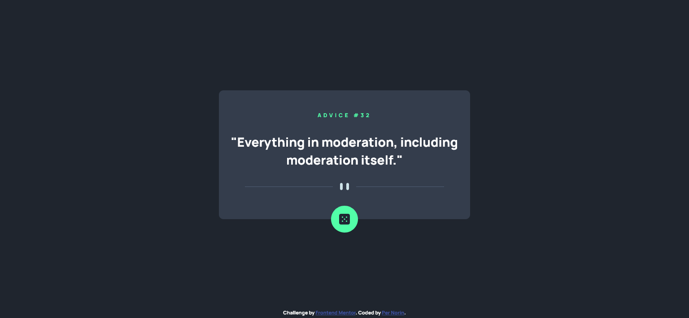

# Frontend Mentor - Advice generator app solution

This is a solution to the [Advice generator app challenge on Frontend Mentor](https://www.frontendmentor.io/challenges/advice-generator-app-QdUG-13db). Frontend Mentor challenges help you improve your coding skills by building realistic projects.

## Table of contents

- [Overview](#overview)
  - [The challenge](#the-challenge)
  - [Screenshot](#screenshot)
  - [Links](#links)
- [My process](#my-process)
  - [Built with](#built-with)
- [Author](#author)

## Overview

### The challenge

Users should be able to:

- View the optimal layout for the app depending on their device's screen size
- See hover states for all interactive elements on the page
- Generate a new piece of advice by clicking the dice icon

### Screenshot

### Links

- Solution URL: 
- Live Site URL: 

## My process

### Built with

- HTML
- CSS
- JavaScript
- acync/await
- Mobile-first workflow

### What I did

- The colors given in the style-guide didn't really match the design images so I had to figure the right colors out.

## Author

Per Norin

- Frontend Mentor - [@pernorin](https://www.frontendmentor.io/profile/pernorin)
- Github - [pernorin](https://github.com/pernorin)
